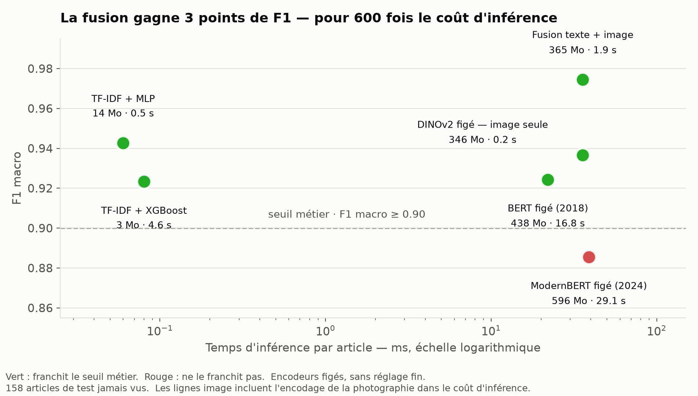
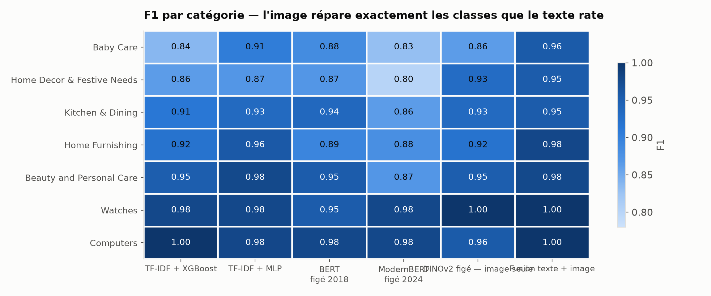
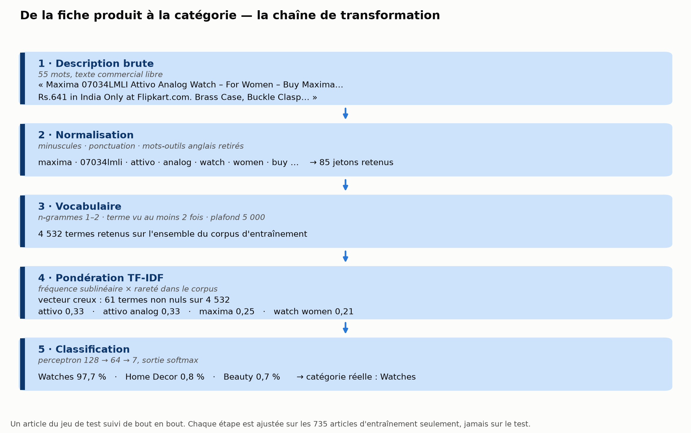

# Catégorisation automatique d'articles

Classer une fiche produit dans la bonne catégorie, à partir de sa description et de sa photographie.
Six approches comparées à protocole constant — et la question n'est pas « laquelle gagne » mais
**« ce qu'elle coûte »**.

[](https://github.com/richardhugou/product-category-classifier/actions/workflows/ci.yml)

---

## Le problème

Sur une place de marché, la catégorie d'un article est choisie par le vendeur. C'est manuel, donc
faux une fois sur combien ? Un article mal rangé est un article introuvable : invendu côté vendeur,
invisible côté acheteur. Le problème n'a rien de spécifique au commerce en ligne — tickets de
support, documents, réclamations, pièces détachées : toute organisation range des objets dans des
catégories.

## Le résultat

| Approche | F1 macro | F1 classe la plus faible | Entraînement | Inférence | Empreinte | Seuil métier |
|---|---|---|---|---|---|---|
| **Fusion texte + image** | **0,974** | **0,955** | 1,9 s | 35,8 ms | 365 Mo | ✅ |
| TF-IDF + MLP | 0,943 | 0,870 | **0,5 s** | **0,06 ms** | 14 Mo | ✅ |
| DINOv2 figé — image seule | 0,937 | 0,864 | 0,2 s | 35,7 ms | 346 Mo | ✅ |
| BERT figé (2018) | 0,924 | 0,870 | 16,8 s | 22,0 ms | 438 Mo | ✅ |
| TF-IDF + XGBoost | 0,923 | 0,837 | 4,6 s | 0,08 ms | **2,6 Mo** | ✅ |
| ModernBERT figé (2024) | 0,885 | 0,800 | 29,1 s | 38,9 ms | 596 Mo | ❌ |



Le seuil métier — F1 macro ≥ 0,90 — a été **fixé avant toute mesure**. Cinq approches sur six le
franchissent : la performance les sépare de moins de 9 centièmes, alors que leur coût d'inférence
varie d'un facteur 600. **La performance ne permet pas de choisir, le coût si.**

**La fusion gagne 3 points de F1 macro, et 8 points sur la catégorie la plus faible** — de 0,870 à
0,955. L'image répare précisément les classes que le texte confond.



Sur 158 articles de test, **7 sont rattrapés par la photographie** : le texte les classe mal, la
fusion les classe bien. Un lange décrit en termes de matière et de dimensions passe pour un article
d'ameublement ; sa photographie ne laisse aucun doute.

### Ce que ce résultat ne dit pas

Les encodeurs sont utilisés **figés**, sans réglage fin. Ce qui est mesuré est **une représentation,
pas la capacité d'un modèle** — un BERT réglé finement changerait probablement le classement.

Et le verdict sur les encodeurs figés **dépend de la modalité**, ce qui est un résultat en soi :
DINOv2 est entraîné en auto-supervision précisément pour produire de bonnes représentations figées,
et il tient ses promesses ; un modèle de langage masqué dont on moyenne les jetons n'a jamais été
entraîné pour ça, et il déçoit. « Encodeur pré-entraîné figé » n'est pas une catégorie homogène.

## Du modèle à la décision — le seuil de confiance

Le modèle ne tranche que s'il dépasse un seuil ; en dessous, l'article part en revue humaine.

| Seuil | Fusion — couverture | Fusion — erreurs | Texte seul — couverture | Texte seul — erreurs |
|---|---|---|---|---|
| 0,50 | 92,4 % | 1,4 % | 91,1 % | 2,8 % |
| **0,60** | **82,9 %** | **aucune sur 131 articles** | 84,2 % | 2,3 % |
| 0,70 | 71,5 % | aucune sur 113 | 76,6 % | 0,8 % |
| 0,80 | 62,0 % | aucune sur 98 | 67,7 % | aucune sur 107 |

La fusion atteint zéro erreur observée **dès 0,60**, en couvrant 83 % du volume. Le modèle texte doit
monter à 0,80 pour en faire autant, et ne couvre alors que 68 %.

> On écrit « aucune erreur sur les 131 articles concernés », jamais « 100 % de précision » : sur cet
> effectif, un taux nul est un intervalle de confiance, pas une garantie.

## Les carnets, dans l'ordre

Chaque carnet répond à une question et se lit sans exécuter le code — les sorties sont conservées.

| # | Carnet | La question posée |
|---|---|---|
| 01 | [Exploration et préparation](notebooks/01_eda_etl.ipynb) | Cette donnée mérite-t-elle qu'on lui fasse confiance ? |
| 02 | [Visualisation](notebooks/02_visualisation.ipynb) | Les catégories se distinguent-elles ? |
| 03 | [Modèles texte](notebooks/03_modele_texte.ipynb) | La description suffit-elle ? |
| 04 | [Modèle image](notebooks/04_modele_image.ipynb) | La photographie apporte-t-elle ce qui manque ? |
| 05 | [Modèle combiné](notebooks/05_modele_combine.ipynb) | Leur somme répare-t-elle les erreurs ? |
| 06 | [Comparaison](notebooks/06_comparaison.ipynb) | Quoi mettre en production, et pourquoi ? |

Le carnet 01 documente deux arbitrages qui coûtent du score volontairement : l'exclusion du champ
`brand`, dont l'absence prédisait la catégorie, et la reconnaissance que la vérité terrain est
déclarative, donc bornée.

## Les données

1 050 fiches produit, **7 catégories exactement équilibrées** à 150 articles chacune, chacune avec
une description en anglais et une photographie. L'équilibre des classes est parfait ; celui de
l'information ne l'est pas — la description médiane va de 24 mots pour *Home Furnishing* à 88 pour
*Kitchen & Dining*.




## Reproduire

```bash
python -m venv .venv && source .venv/bin/activate
pip install -r requirements-dev.txt
make all
```

`make all` entraîne les modèles texte, écrit `reports/benchmark.csv` et regénère les figures. Une
dizaine de secondes.

Pour le tableau complet — encodeurs de texte, image et fusion. Le premier lancement télécharge
environ 1,4 Go de poids, et attend les photographies dans `data/Flipkart/Images/` :

```bash
pip install -r requirements-encoders.txt
make benchmark ENCODERS=1 IMAGES=1
```

Les autres cibles : `make test`, `make lint`, `make notebooks`, `make demo`. `make help` les liste.

## Structure

```
├── src/
│   ├── pipeline.py      chargement et découpe — source unique, appelée partout
│   ├── text.py          TF-IDF et encodeurs de texte figés
│   ├── images.py        caractéristiques visuelles, mises en cache
│   ├── fusion.py        concaténation après normalisation L2 ligne par ligne
│   ├── evaluate.py      métriques et arbitrage au seuil
│   └── figures.py       les quatre figures
├── notebooks/           les six carnets, exécutés
├── tests/               21 tests, dont le test anti-fuite
├── scripts/             profilage, rejeu des carnets
├── benchmark.py         les six approches, protocole constant
├── app.py               démonstration — texte seul et fusion, côte à côte
└── docs/RAPPORT.md      rapport de conduite de projet
```

**Une seule chose découpe les données** : `src/pipeline.py`, en 70 / 15 / 15 stratifié à graine fixe.
Les carnets, le benchmark et la démonstration l'appellent tous. C'est ce qui garantit que les
chiffres se comparent entre eux, et `tests/test_pipeline.py` vérifie que les trois plis sont
disjoints — le test anti-fuite du projet.

## Organisation du dépôt

`main` porte les versions publiées, `develop` intègre, et chaque lot de travail a vécu sur sa propre
branche avant d'être fusionné :

```
feature/cicd · feature/eda-etl · feature/visualisation
feature/text-embedding · feature/image-embedding · feature/combined-embedding
feature/model-comparison · feature/demo-app · feature/documentation
```

L'intégration continue tourne sur `main`, `develop` et toute branche `feature/**` : lint, format,
tests, puis un travail de vérification qui rejoue le profilage et le benchmark texte depuis un clone
propre. Les encodeurs pré-entraînés en sont exclus — 1,4 Go de poids par exécution serait
disproportionné.

## Licence

MIT — voir [LICENSE](LICENSE). Jeu Flipkart de 1 050 produits, distribué sans contrainte de propriété
intellectuelle dans le cadre d'un exercice de faisabilité. Le CSV est versionné ici ; les
photographies ne le sont pas — 351 Mo — et se placent dans `data/Flipkart/Images/`.
