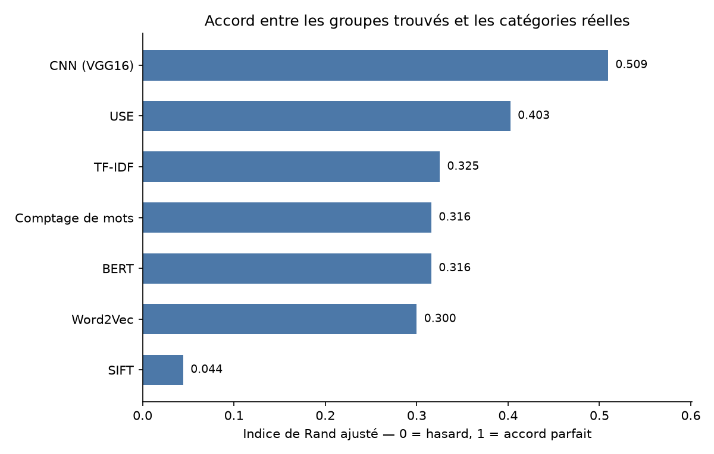

# Étude de faisabilité d'un moteur de classification automatique d'articles

**À partir des descriptions textuelles et des photographies de produits**

Richard Hugou — Data Scientist junior · août 2026

---

# 1. Contexte et objectif de la mission

L'entreprise « Place de marché » prépare le lancement d'une marketplace en ligne anglophone, sur
laquelle des vendeurs indépendants proposeront leurs articles à des acheteurs en publiant une
photographie et une description.

Dans le fonctionnement prévu, chaque vendeur choisit lui-même la catégorie de son article au moment de
la mise en ligne. Sur un catalogue réduit, cette organisation reste gérable. Elle devient plus
difficile à tenir à mesure que le nombre de produits augmente : deux vendeurs peuvent classer des
articles semblables à deux endroits différents, et un produit rangé au mauvais endroit devient plus
difficile à retrouver. L'acheteur qui filtre par catégorie ne le voit pas, et le vendeur, lui, n'a
aucun moyen de savoir pourquoi son article ne se vend pas.

Le volume d'articles est aujourd'hui faible, et c'est précisément ce qui rend le moment opportun :
l'automatisation doit être en place avant que le catalogue grossisse. L'enjeu est double — faciliter la
mise en ligne pour les vendeurs, et fiabiliser la recherche pour les acheteurs.

Linda, Lead Data Scientist, nous confie donc une étude de faisabilité, que nous menons en tant que
Data Scientist junior. Il ne s'agit pas de construire ni de déployer le moteur définitif, mais de
répondre à une question préalable dont dépend tout le reste : les informations déjà présentes dans une
fiche produit — le texte de la description et la photographie — permettent-elles de retrouver
automatiquement sa catégorie ?

Sa demande précise la démarche attendue, et celle-ci donne son plan au présent rapport. Il faut d'abord
prétraiter les données textuelles et visuelles, puis en extraire des caractéristiques numériques selon
plusieurs méthodes nommément désignées : pour le texte, un comptage simple de mots, une pondération
TF-IDF, un plongement de mots de type Word2Vec, puis deux approches de représentation de phrase, BERT
et USE ; pour l'image, une méthode à points d'intérêt de type SIFT et un réseau convolutif utilisé en
transfert. Il faut ensuite projeter les produits en deux dimensions pour les observer, analyser
graphiquement si les catégories se dessinent, et confirmer cette analyse visuelle par une mesure
comparant les catégories réelles à une segmentation en clusters. Une seconde étape demande une
classification supervisée à partir des images, optimisée par data augmentation. Une troisième, enfin,
consiste à tester la collecte de produits d'épicerie fine via une API publique, dans la perspective
d'élargir la gamme.

Une précision avant d'entrer dans le sujet. Nous travaillons sur un échantillon, avec des moyens de
calcul modestes, et sur des données qui ont leurs propres défauts. Les conclusions valent pour ce
périmètre, et nous signalerons à chaque fois ce qui se transpose à un catalogue réel et ce qui
demanderait à être revérifié.

---

# 2. Découverte et préparation des données

Le jeu de données transmis par Linda contient 1 050 articles répartis dans 7 catégories, à raison de
150 produits chacune. Chaque article dispose d'une description rédigée en anglais par le vendeur et
d'une photographie, ainsi que d'une quinzaine de champs annexes — prix, note, identifiants — que la
mission ne retient pas puisqu'elle porte explicitement sur le texte et l'image.

Le meilleur moyen de comprendre ce jeu est d'en ouvrir une entrée. Prenons une montre, que nous
garderons sous la main jusqu'à la fin de l'étude :

| Champ | Contenu |
|---|---|
| `product_name` | V9 METAL STRAP Analog Watch – For Men |
| `description` | *Specifications of V9 METAL STRAP Analog Watch – For Men. General Type Analog. Style Code METAL STRAP. Occasion Casual. Ideal For Men. Warranty NO. Body Features Dial Shape Round. Strap Color STEEL. Dial Color BLACK.* |
| `product_category_tree` | `["Watches >> Wrist Watches >> V9 Wrist Watches >> ..."]` |
| `image` | une photographie de 1 152 × 1 816 pixels |

La catégorie que nous cherchons à prédire n'est pas donnée directement : elle est enfouie dans une
chaîne décrivant tout un chemin d'arborescence, mal formée, avec des guillemets échappés de façon
incohérente. Nous en extrayons le premier niveau, ce qui produit les sept catégories annoncées —
*Baby Care*, *Beauty and Personal Care*, *Computers*, *Home Decor & Festive Needs*, *Home Furnishing*,
*Kitchen & Dining* et *Watches*. Descendre d'un niveau supplémentaire donnerait des dizaines de classes
ne comptant que quelques produits, ce qui n'est pas exploitable à cette échelle. Notre cible est donc
définie sans ambiguïté, mais sa fiabilité reste limitée : c'est le vendeur qui a choisi cette
catégorie, et c'est précisément parce que ce choix est faillible que la mission existe. Nous y
reviendrons au moment d'interpréter les résultats.

## Ce que contiennent réellement les descriptions et les photographies

La description de notre montre illustre une caractéristique générale du corpus : ce ne sont pas des
textes rédigés. Le vendeur a rempli un formulaire de spécifications, que la plateforme a aplati en une
suite de mots. On y retrouve le nom du produit répété plusieurs fois, des paires attribut-valeur
collées les unes aux autres, et parfois des fautes de frappe. Les descriptions comportent entre 13 et
587 mots, avec une médiane de 44.

Cette dispersion n'est pas répartie au hasard entre les catégories. Un article de *Home Furnishing* se
décrit en 24 mots médians, un article de *Kitchen & Dining* en 88 — près de quatre fois plus. Les sept
catégories sont donc parfaitement équilibrées en nombre de produits, mais pas du tout en quantité
d'information disponible. Ce point mérite d'être noté dès maintenant, car il explique en partie
pourquoi certaines catégories seront plus difficiles à retrouver que d'autres.


Les photographies présentent une hétérogénéité comparable, sous une autre forme. Sur les 1 050
fichiers, on compte 890 tailles distinctes ; la plus fréquente, 1 100 × 844 pixels, ne concerne que
23 images. Les rapports largeur/hauteur s'échelonnent de 0,23 à 4,36, et le plus gros fichier atteint
93 mégapixels. Notre montre, avec ses 1 152 × 1 816 pixels, est un format vertical parmi beaucoup
d'autres. Les méthodes d'extraction que nous emploierons ensuite attendent chacune un format d'entrée
précis : les images devront donc être harmonisées en fonction de leurs contraintes respectives.

## Ce que nous écartons, et comment nous préparons le reste

Un champ mérite une attention particulière avant d'aller plus loin. Le champ `brand` est renseigné pour
712 produits sur 1 050 ; il manque donc dans 32 % des cas. On serait tenté de le conserver et d'ajouter
un indicateur signalant son absence, ce qui est une pratique courante. Ce serait ici une erreur, car
ces valeurs manquantes ne sont pas réparties au hasard :

| Catégorie | Marque absente |
|---|---|
| Watches | 140 / 150 |
| Beauty and Personal Care | 109 / 150 |
| Kitchen & Dining | 71 / 150 |
| Baby Care | 16 / 150 |
| Home Decor & Festive Needs | 2 / 150 |
| Computers | 0 / 150 |
| Home Furnishing | 0 / 150 |

Parmi les 338 produits sans marque, 95 % appartiennent à trois catégories seulement, et aucun produit
d'informatique ou d'ameublement n'a la case vide. Autrement dit, le seul fait que le champ soit vide
renseigne fortement sur la catégorie — pour une raison qui tient aux habitudes de saisie des vendeurs
et non à la nature des produits. Un modèle qui recevrait cette information apprendrait à lire cette
habitude plutôt que le produit, et ses performances s'effondreraient dès qu'un vendeur de montres se
mettrait à renseigner sa marque. Nous écartons donc ce champ, indicateur d'absence compris.

Le prétraitement du texte suit ensuite une chaîne classique : passage en minuscules, suppression de la
ponctuation et des chiffres isolés, découpage en mots, puis retrait des mots-outils anglais — *of*,
*for*, *the* — qui apparaissent partout et ne distinguent rien. Appliquée à notre montre, cette chaîne
ramène 34 mots bruts à 29 jetons retenus :

```
specifications · metal · strap · analog · watch · men · general · type · analog · style · code ·
metal · strap · occasion · casual · ideal · men · warranty · body · features · dial · shape ·
round · strap · color · steel · dial · color · black
```

Nous ne pratiquons ni racinisation ni lemmatisation. Sur un vocabulaire de fiches produit, `bedsheet`
et `bedsheets` portent la même information et sont appris sans difficulté ; en revanche, tronquer les
mots détruirait des références de modèles comme `7007YL08`, qui sont parfois les termes les plus
discriminants d'une fiche.

Du côté des images, le traitement dépend de la méthode qui les consommera. Pour le réseau convolutif,
chaque photographie est convertie en RGB, redimensionnée en carré de 224 pixels et normalisée selon les
statistiques du jeu sur lequel ce réseau a été entraîné, faute de quoi ses représentations perdraient
leur sens. Pour SIFT, qui travaille sur l'intensité lumineuse et non sur la couleur, les images sont
converties en niveaux de gris, égalisées en contraste et ramenées à 256 pixels de côté. Une même
photographie donne donc deux entrées différentes selon l'usage, ce qui est normal : la préparation
n'est pas une étape neutre, elle est déjà un choix de méthode.

À ce stade, nous savons ce que contient le jeu, ce qu'il vaut et ce que nous en écartons. Il reste que
ni une description ni une photographie ne peuvent être comparées directement à une autre par un
algorithme, qui ne manipule que des nombres. C'est l'objet de la partie suivante.

---

# 3. Étude de faisabilité à partir du texte et des images

Linda demande de vérifier si les produits d'une même catégorie se regroupent spontanément une fois
traduits en représentations numériques, et impose pour cela des méthodes précises : cinq pour le texte,
deux familles pour l'image. Nous les appliquons toutes au même corpus et, pour pouvoir les comparer
entre elles, à la même montre.

Une précision de protocole avant de commencer. Cette étude est non supervisée : les catégories ne
servent qu'à colorier les graphiques et à mesurer l'accord final, jamais à construire les
représentations. Nous pouvons donc les ajuster sur l'ensemble des 1 050 produits sans risquer la
moindre fuite d'information. La question posée n'est pas encore « savons-nous prédire ? » mais
« l'information est-elle présente ? ».

## Représenter le texte

Le **comptage simple de mots** est la méthode la plus directe : on établit le vocabulaire du corpus,
puis on compte combien de fois chaque mot apparaît dans chaque description. Le vocabulaire ainsi
obtenu compte 2 444 mots, et chaque produit devient une liste de 2 444 nombres dont la grande majorité
vaut zéro. Notre montre en a 22 non nuls, les plus élevés étant `strap` (3 occurrences), puis `analog`,
`color`, `dial`, `men` et `metal` (2 chacun). C'est la référence la plus rudimentaire que l'on puisse
construire, et c'est à ce titre qu'elle sert : toutes les méthodes qui suivent devront justifier leur
coût par rapport à elle.

Une première variante consiste à compter aussi les paires de mots, ce qui permet de distinguer *round
strap* de *round* et *strap* pris séparément. Le vocabulaire passe alors à 5 000 termes, et notre
montre à 42 valeurs non nulles. Nous conservons les deux versions, précisément parce que seule cette
option change de l'une à l'autre : l'écart entre elles ne peut donc venir que des paires.

Le **TF-IDF** reprend ce comptage et le pondère par la rareté du terme dans le corpus : un mot présent
dans toutes les fiches ne distingue rien et doit peser peu. L'effet se lit directement sur notre montre.
Le terme `color`, qui arrivait en tête avec le comptage simple, disparaît des premiers rangs parce
qu'il apparaît dans presque toutes les fiches du catalogue, quelle que soit la catégorie. Ce sont
`metal` et `strap` qui dominent :

| Terme | Comptage simple | TF-IDF |
|---|---|---|
| strap | 3 | 0,246 |
| metal | 2 | **0,272** |
| color | 2 | *sort du classement* |
| dial | 2 | 0,199 |
| strap analog | 1 | 0,215 |
| round strap | 1 | 0,181 |


Ces deux représentations partagent une propriété précieuse : chaque dimension correspond à un terme que
l'on peut nommer, ce qui permettrait plus tard d'expliquer une décision. Elles partagent aussi une
limite : elles ignorent le sens. Pour elles, *sofa* et *couch* sont deux dimensions étrangères l'une à
l'autre, sans aucun lien.

C'est ce que les trois méthodes suivantes cherchent à corriger. **Word2Vec** apprend un vecteur par
mot, de telle sorte que deux mots employés dans des contextes semblables se retrouvent proches ; la
description devient la moyenne des vecteurs de ses mots, soit 300 nombres. Nous entraînons ce modèle
sur nos 1 050 descriptions, ce qui est peu pour apprendre une sémantique — nous verrons que le résultat
s'en ressent. **BERT** apporte un contexte : chaque mot reçoit une représentation qui dépend de ses
voisins, si bien que *mouse* n'a pas le même vecteur dans une fiche informatique et dans une fiche
animalerie. Nous utilisons le modèle tel quel, sans le réentraîner, et moyennons ses sorties pour
obtenir 768 nombres par produit. **USE**, enfin, est entraîné à représenter une phrase entière plutôt
que des mots que l'on moyennerait ensuite, et produit 512 nombres. Nous employons le modèle de
référence publié par ses auteurs ; les précautions techniques que cela a demandées sont décrites en
annexe C.

## Représenter les images

**SIFT** procède tout autrement. Plutôt que de décrire l'image entière, il repère les points
remarquables — coins, contrastes marqués, motifs — et décrit chacun par 128 nombres caractérisant son
voisinage immédiat. Sur la photographie de notre montre, il en détecte 508. Le problème est que ce
nombre varie d'une image à l'autre, alors qu'il nous faut des vecteurs de taille identique pour
comparer les produits. La solution classique consiste à construire un vocabulaire visuel : on rassemble
les 482 202 descripteurs extraits des 1 050 photographies, on les regroupe en 256 familles, et chaque
image devient l'histogramme du nombre de ses points tombant dans chaque famille. C'est exactement la
logique du sac de mots appliquée à l'image, avec des « mots visuels » à la place des termes.

Le **réseau convolutif en transfert** repose sur une idée différente. Nous prenons VGG16, entraîné à
reconnaître un millier d'objets sur ImageNet, et nous lui retirons sa couche de classification finale.
Ce qui reste est un extracteur : l'image entre, et il en sort 512 nombres qui résument ce que le réseau
y a reconnu. Le réseau n'est pas réentraîné sur nos produits — nous réutilisons tel quel ce qu'il a
appris ailleurs, ce qui est précisément le principe du transfert.

À ce stade, chaque produit existe sous sept formes numériques différentes, de 256 à 5 000 dimensions.
Reste à savoir laquelle rapproche les produits d'une même catégorie.

## Projeter et regarder

Un espace à 512 ou 5 000 dimensions ne se visualise pas. Nous le réduisons donc en deux temps : une
analyse en composantes principales ramène d'abord chaque représentation à 50 dimensions en conservant
l'essentiel de sa variance, puis t-SNE la met en plan. Ce second algorithme cherche à préserver les
voisinages plutôt que les distances globales, ce qui a une conséquence de lecture importante : sur les
graphiques qui suivent, la proximité entre deux points a un sens, mais ni l'échelle des axes ni la
distance entre deux îlots éloignés n'en ont.

Une précaution a été nécessaire avant de projeter. Les descriptions n'ayant pas toutes la même
longueur, un produit bavard occupe mécaniquement une position plus éloignée de l'origine qu'un produit
laconique, alors que la longueur du texte ne dit rien de sa catégorie. Nous ramenons donc chaque produit
à une longueur unitaire. La tentation inverse — standardiser chaque dimension pour qu'elles aient toutes
la même variance — aurait été plus dommageable encore : sur 5 000 dimensions dont la plupart sont vides,
elle revient à donner à un terme apparu trois fois dans tout le corpus le même poids qu'à un terme
structurant. Nous l'avions d'abord fait, et l'accord mesuré sur la représentation TF-IDF complète
tombait alors à 0,001, c'est-à-dire au niveau du hasard.


La lecture de ces graphiques est assez directe. Les représentations de texte produisent toutes une
structure partielle : quelques îlots nettement colorés — les montres, l'informatique — et un centre où
plusieurs catégories se mélangent. La projection issue de VGG16 est la plus organisée, avec des zones
colorées larges et peu d'interpénétration. Celle de SIFT, à l'inverse, est un nuage homogène dans
lequel aucune couleur ne se détache : les points de toutes les catégories y sont répartis
uniformément.

## Mesurer pour confirmer

L'œil peut se tromper, et une projection en deux dimensions déforme nécessairement. Linda demande donc
une mesure, et nous procédons comme suit : nous masquons les catégories, nous laissons un algorithme de
partitionnement (K-means) former sept groupes à partir des seules représentations, puis nous comparons
ces groupes aux vraies catégories à l'aide de l'indice de Rand ajusté.

Cet indice compare deux découpages d'un même ensemble. Il vaut 1 lorsqu'ils coïncident et 0 lorsque
leur accord n'excède pas ce que produirait le hasard. L'ajustement est essentiel ici : avec sept groupes
de tailles voisines, deux découpages tirés au sort présentent déjà un accord apparent non négligeable,
que l'indice brut compterait à tort comme un succès.

Un point mérite d'être souligné, car la confusion est facile et fausserait toute la lecture qui suit :
**un indice de 0,51 ne signifie pas que 51 % des produits sont correctement catégorisés.** Ce n'est pas
une proportion. C'est une mesure de correspondance entre deux partitions, et les groupes formés n'ont
d'ailleurs pas de nom — rien ne dit *a priori* lequel correspond aux montres. La question posée à ce
stade est seulement de savoir si le découpage produit sans étiquettes ressemble au découpage
commercial, pas de compter des bonnes réponses.

Nous rapportons cette mesure deux fois. Une première sur la projection, puisque c'est elle que nous
avons regardée et que la mission demande de confirmer l'analyse visuelle. Une seconde sur la
représentation complète, avant réduction, car t-SNE déforme et il serait commode de ne retenir que le
plus flatteur des deux chiffres.

| Représentation | Source | Dimensions | Accord sur la projection | Accord avant réduction |
|---|---|---|---|---|
| **CNN (VGG16)** | image | 512 | **0,510** | **0,540** |
| USE | texte | 512 | 0,440 | 0,333 |
| TF-IDF | texte | 5 000 | 0,325 | 0,214 |
| Comptage + bigrammes | texte | 5 000 | 0,316 | 0,227 |
| BERT | texte | 768 | 0,316 | 0,288 |
| Comptage de mots | texte | 2 444 | 0,306 | 0,270 |
| Word2Vec | texte | 300 | 0,300 | 0,207 |
| SIFT | image | 256 | 0,044 | 0,056 |



Quatre observations ressortent de ce tableau.

L'image l'emporte nettement, mais à condition d'être traitée par le bon outil. VGG16 atteint 0,510
quand SIFT ne produit qu'un accord très faible, proche du hasard, alors que les deux méthodes reçoivent
exactement les mêmes photographies. L'écart s'explique : SIFT décrit des motifs locaux — un angle, une
texture, un contraste — utiles pour reconnaître qu'une même scène a été photographiée deux fois, mais
qui ne disent rien de ce qu'est l'objet. VGG16, entraîné à reconnaître des objets, produit une
description de nature sémantique. C'est un résultat instructif sur le plan méthodologique : une méthode
reconnue peut se révéler inadaptée non par manque de qualité, mais parce qu'elle répond à une autre
question que la nôtre.

VGG16 est aussi la seule représentation dont l'accord est meilleur avant réduction qu'après. Les
catégories y sont donc réellement séparées dans l'espace d'origine, et non révélées par le passage en
deux dimensions. Pour les représentations textuelles, l'écart entre les deux colonnes va dans l'autre
sens : la structure existe, mais elle est plus difficile à isoler directement. C'est là que la double
mesure prend tout son sens — lue seule, la colonne de gauche aurait accordé aux méthodes textuelles une
netteté que l'espace d'origine ne confirme pas.

Du côté du texte, USE se détache avec 0,440, tandis que les cinq autres méthodes se tiennent entre
0,300 et 0,325. Le résultat le plus frappant est que le comptage simple de mots (0,306) fait
pratiquement jeu égal avec BERT (0,316), et le devance même dans l'espace complet — 0,270 contre 0,288
pour BERT, mais surtout contre 0,214 pour TF-IDF. Sur des fiches de spécifications, où le vocabulaire
est très discriminant et la syntaxe quasi absente, comprendre le contexte n'apporte presque rien de
plus que compter les mots. Word2Vec, entraîné sur seulement 1 050 descriptions, arrive dernier, ce qui
était prévisible au vu du volume disponible.

L'apport des bigrammes, enfin, est ambigu. Ils font gagner un point sur la projection (0,306 → 0,316)
mais en font perdre quatre dans l'espace complet (0,270 → 0,227). Multiplier par deux la taille du
vocabulaire ne rend donc pas la structure plus nette ; cela la disperse. Le résultat n'était pas acquis
d'avance, et il justifie d'avoir gardé les deux versions plutôt que d'ajouter les paires de mots par
habitude.

## Ce que l'étude établit


Le tableau croisé des sept groupes formés par VGG16 et des sept catégories réelles montre une
correspondance de un à un : chaque catégorie a son groupe dominant, et aucun groupe n'en accueille deux
majoritairement. L'informatique et les montres sont retrouvées à 87 % et 86 %, la beauté à 80 %.

Deux catégories résistent, et l'examen des produits concernés éclaire pourquoi. *Home Furnishing* se
scinde presque en deux : 71 produits dans son groupe, 69 dans celui de *Baby Care*. En regardant ce que
contient cette seconde moitié, on trouve des housses de coussin, des couettes, des tapis de bain — et
dans le groupe *Baby Care* qui les accueille, des serviettes en coton, des ensembles pyjama pour bébé
et des protège-matelas. Ce groupe ne correspond à aucune des deux catégories : il rassemble des
textiles imprimés photographiés à plat. L'algorithme a regroupé par matière et par mise en scène, ce
qui est ce qu'on lui a demandé de faire, alors que la nomenclature du site regroupe par usage
commercial. Une couette et un pyjama de bébé n'ont rien en commun pour un acheteur ; ils se ressemblent
beaucoup pour un réseau de vision.

La même mécanique semble expliquer le second point faible, *Home Decor & Festive Needs*, dont 31
produits partent dans le groupe de l'ameublement : porte-clés en bois, statuettes, décorations
murales — des objets décoratifs photographiés seuls, comme le sont beaucoup d'articles d'ameublement.

Nous pouvons donc répondre à la question de Linda. L'information nécessaire à la catégorisation est
bien présente dans les données fournies, et elle l'est suffisamment pour que des groupes cohérents
émergent sans qu'aucune étiquette n'ait été montrée. Les photographies traitées par un réseau
pré-entraîné constituent la source la plus prometteuse, devant les descriptions textuelles. Quant aux
confusions résiduelles, elles semblent tenir à un écart entre deux logiques de regroupement, l'une
visuelle et l'autre commerciale — nous verrons dans la partie suivante si la supervision les résorbe.

---

# 4. Classification supervisée des images

L'étude précédente a montré que les caractéristiques extraites par un réseau convolutif organisent le
catalogue sans qu'on ait eu besoin de montrer une seule étiquette. Linda demande maintenant d'aller
plus loin sur cette piste : puisque l'information est présente dans les photographies, que devient la
performance lorsqu'on entraîne réellement un modèle à prédire la catégorie ?

La question change de nature, et le protocole avec elle. Tant qu'on cherchait à savoir si des groupes
existaient, tout le corpus pouvait servir, puisqu'aucune étiquette n'entrait dans le calcul. Il faut à
présent réserver des produits que le modèle ne verra pas pendant son apprentissage, faute de quoi la
performance mesurée ne dirait rien de son comportement sur un article nouveau. Nous découpons donc les
1 050 produits en trois parts stratifiées et fixées une fois pour toutes : 735 pour l'entraînement, 157
pour la validation, 158 réservés à l'évaluation finale.

Cette découpe en trois, plutôt qu'en deux, mérite qu'on s'y arrête, car elle a corrigé une erreur de
notre part. Nous avions d'abord comparé plusieurs stratégies d'entraînement directement sur le jeu de
test, puis retenu la meilleure. Le procédé paraît anodin, mais dès lors que le résultat du test oriente
le choix suivant, ce jeu mesure la qualité de notre sélection autant que celle du modèle. Le jeu de
validation existe précisément pour absorber ces comparaisons. Toutes les décisions qui suivent sont donc
prises sur les 157 produits de validation, et le jeu réservé n'est ouvert qu'ensuite, avec le seul
modèle retenu.

Le modèle lui-même reprend le réseau de la partie précédente. VGG16 conserve ses poids d'origine et sert
d'extracteur ; seule une petite tête de classification est apprise par-dessus. C'est le protocole
habituel du transfert, et le seul raisonnable ici : réajuster les 138 millions de paramètres du réseau
sur 735 images conduirait à ce qu'il apprenne ces images plutôt que la tâche.

Le fonctionnement se résume simplement. La photographie entre dans le réseau figé, qui en produit 512
nombres ; la tête reçoit ces 512 nombres et rend 7 probabilités, une par catégorie. Sur la photographie
de notre montre — qui appartient au jeu réservé et n'a donc jamais servi à l'apprentissage — la réponse
est *Watches* avec une probabilité de 0,977, la deuxième catégorie la plus probable ne recueillant que
0,011. C'est un cas facile : une montre sur fond blanc ne ressemble à rien d'autre dans le catalogue.

## Chercher à faire mieux : la data augmentation

Linda demande de mettre en place une data augmentation pour tenter d'améliorer le modèle. Le principe
consiste à fabriquer artificiellement de nouvelles images d'entraînement en transformant celles dont on
dispose : les retourner, les faire pivoter légèrement, les recadrer, en modifier le contraste. Le modèle
voit ainsi plus d'exemples, et devrait apprendre à reconnaître un produit indépendamment de la façon
dont il a été photographié.

Le choix des transformations n'est pas neutre. Nos images sont des photographies de catalogue,
généralement centrées et cadrées de la même manière. Un retournement horizontal ou une légère rotation
restent plausibles — le même article aurait pu être photographié dans l'autre sens. Un retournement
vertical, en revanche, produirait des images qu'on ne rencontrera jamais.

Nous testons quatre stratégies, et cette variété fait partie du raisonnement : conclure à partir d'un
seul réglage laisserait ouverte l'objection qu'il était mal choisi. Une augmentation dite douce se
limite au retournement horizontal et à une rotation de dix degrés. Une augmentation forte y ajoute un
recadrage aléatoire, une rotation de quinze degrés et une variation de couleur. Chacune est appliquée
quatre fois par image, et la version forte est aussi testée à huit fois pour observer l'effet du volume.

| Stratégie | Images d'entraînement | F1 macro sur la validation |
|---|---|---|
| Augmentation douce ×4 | 3 675 | **0,828** |
| Augmentation forte ×4 | 3 675 | 0,827 |
| Sans augmentation | 735 | 0,822 |
| Augmentation forte ×8 | 6 615 | 0,815 |

Sur le jeu de validation, l'augmentation douce obtient le meilleur score, mais le gain de 0,006 point de
F1 macro — soit moins d'un produit sur 157 — est trop faible pour conclure à une amélioration nette. Les
transformations douces et fortes appliquées quatre fois donnent des résultats très proches de la
référence. Une augmentation plus forte et répétée, en revanche, dégrade nettement la performance. Une
explication possible tient à la nature très standardisée des photographies du catalogue : multiplier les
transformations artificielles peut éloigner les images d'entraînement de la distribution réellement
observée. C'est une hypothèse plausible, que ces quatre essais ne suffisent pas à démontrer.

Le résultat est en revanche plus intéressant lorsqu'on le regarde catégorie par catégorie, car
l'augmentation n'est pas sans effet : elle déplace les erreurs.

| Catégorie | Sans | Douce ×4 | Forte ×4 | Forte ×8 |
|---|---|---|---|---|
| Baby Care | 0,750 | 0,762 | 0,762 | **0,818** |
| Home Decor & Festive Needs | 0,739 | 0,776 | **0,792** | 0,773 |
| Watches | 0,818 | 0,851 | **0,864** | 0,818 |
| Beauty and Personal Care | 0,810 | 0,800 | 0,810 | **0,829** |
| Kitchen & Dining | 0,920 | 0,913 | **0,939** | 0,898 |
| Computers | **0,810** | 0,809 | 0,783 | 0,750 |
| Home Furnishing | **0,905** | 0,884 | 0,837 | 0,818 |


*Baby Care*, la catégorie la plus fragile sans augmentation, gagne près de sept points à mesure que
l'augmentation s'intensifie. *Home Decor* progresse également. Mais *Computers* et *Home Furnishing*
suivent le chemin inverse et perdent respectivement six et neuf points. La moyenne ne bouge pas parce
que les gains et les pertes se compensent.

Ce constat suggère qu'une augmentation générique, appliquée uniformément à tout le catalogue, n'est
probablement pas la meilleure stratégie. Les catégories ne réagissent pas de la même manière aux mêmes
transformations, et des traitements adaptés aux types de produits mériteraient d'être explorés.

Nous retenons donc l'augmentation douce, qui arrive en tête selon la règle de sélection fixée d'avance,
en sachant que son avantage n'est pas établi.

## Le résultat sur le jeu réservé

Le choix étant figé, nous ouvrons les 158 produits mis de côté. Le modèle en classe correctement 137,
soit une exactitude de 86,7 % et une F1 macro de 0,867. Vingt et une erreurs, donc, à partir des seules
photographies.

Ce chiffre mérite d'être situé. Il est obtenu avec un réseau dont aucun poids n'a été réentraîné, sur
735 images d'entraînement, et sans utiliser une seule ligne de description. Pour une étude de
faisabilité, c'est une démonstration solide que l'image seule porte une part importante de
l'information.


La matrice de confusion prolonge directement l'analyse de la partie précédente. Les deux erreurs les
plus nombreuses concernent *Computers*, dispersé vers *Home Decor* et *Kitchen & Dining* à trois
reprises chacune. Mais l'échange le plus significatif est ailleurs : deux *Baby Care* sont prédits
*Home Furnishing*, et deux *Home Furnishing* sont prédits *Baby Care*. C'est la confusion que le
regroupement sans étiquettes avait déjà fait apparaître, lorsque les housses de coussin et les couettes
se retrouvaient dans le même groupe que les serviettes en coton et les pyjamas de bébé.

Cette continuité est le résultat le plus instructif de cette partie. La réapparition de la même
confusion dans deux approches très différentes — l'une sans étiquettes, l'autre supervisée — suggère
qu'elle ne dépend pas uniquement du modèle employé, et qu'il existe une ambiguïté réelle entre certaines
images de ces deux catégories. La supervision la réduit sans la faire disparaître.

---

# 5. Collecte de nouveaux produits via une API

La dernière demande de Linda est indépendante du modèle. La marketplace envisage d'élargir sa gamme à
l'épicerie fine, et il s'agit d'éprouver la faisabilité de la collecte avant d'envisager quoi que ce
soit d'autre : peut-on récupérer automatiquement des produits, avec les informations nécessaires ?

Deux sources étaient proposées. Nous retenons Open Food Facts, parce qu'elle ne demande aucune
inscription : le script reste exécutable tel quel par un tiers, sans clé à transmettre ni compte à
créer. Cette base est alimentée de façon collaborative, ce qui aura son importance au moment de lire les
résultats.

Le fichier attendu doit contenir cinq champs — `foodId`, `label`, `category`, `foodContentsLabel` et
`image` — qui sont ceux du schéma d'Edamam, l'autre source proposée. Il faut donc les faire correspondre
aux champs d'Open Food Facts. Quatre correspondances sont évidentes : le code-barres tient lieu
d'identifiant, le nom du produit de libellé, les catégories et l'adresse de l'image se transposent
directement. La cinquième demande un jugement : `foodContentsLabel` désigne chez Edamam la composition
d'un produit, dont `ingredients_text` est l'équivalent le plus proche. Cette correspondance est isolée
dans un dictionnaire unique du script, de sorte qu'elle soit lisible et discutable plutôt que dispersée
dans le code.

Un choix technique mérite d'être signalé. Plutôt qu'une recherche en texte libre, nous filtrons sur la
catégorie « champagne ». Une recherche plein texte remonterait aussi tout ce qui mentionne le mot sans
en être : vinaigres, sauces, arômes.

L'extraction produit bien les dix produits demandés. Les cinq champs sont renseignés dans presque tous
les cas — la composition manque pour deux produits sur dix. Le fichier est utilisable en l'état.

Ce qu'il contient est plus instructif que le fait qu'il existe. Trois observations se dégagent.

Les catégories sont hétérogènes. Ces dix produits portent cinq étiquettes différentes : *Champagnes*
pour cinq d'entre eux, *French Champagnes* pour trois, *fr:Champagnes bruts* pour trois, *fr:Champagnes
rosés* et *fr:Liquide* pour un chacun. Certaines n'ont pas été traduites et conservent un préfixe de
langue ; l'une d'elles, *fr:Liquide*, ne dit à peu près rien du produit.

Les libellés sont irréguliers. L'un d'eux se lit « Br МОЁ HANDON MOET & CHANDON CHAMPAGNE IMPERIAL BR »,
mélangeant caractères cyrilliques et fragments de texte — trace visible de la saisie collaborative et de
la reconnaissance automatique d'étiquettes.

Enfin, la catégorie source n'est pas toujours juste. Parmi les dix champagnes figure un « MARTINI
Bellini Peach 8,0 % vol », qui est un cocktail à la pêche.

Cette collecte reste exploratoire — dix produits ne permettent pas de caractériser une base entière —
mais elle met déjà en évidence un enjeu de qualité et d'homogénéité des métadonnées, qui devra être
traité en amont du modèle de classification. Établir une correspondance entre la nomenclature de la
marketplace et celles des sources externes, et composer avec des étiquettes source imparfaites, sont des
travaux préalables à tout réentraînement.

On retrouve d'ailleurs, sous une autre forme, la difficulté du point de départ : ici comme sur la
marketplace, les catégories sont déclarées par des contributeurs qui ne suivent pas tous la même règle.

---

# 6. Bilan, limites et perspectives

## Ce que l'étude établit

La réponse à la question de Linda est positive. Les informations déjà fournies par les vendeurs — une
description et une photographie — contiennent l'information nécessaire pour retrouver la catégorie d'un
article.

Cette réponse tient sur deux démonstrations indépendantes. Sans utiliser une seule étiquette, un
algorithme de regroupement retrouve une partition qui correspond substantiellement aux sept catégories
du catalogue, avec un accord de 0,51 pour les caractéristiques visuelles issues d'un réseau
pré-entraîné. Et en supervisé, à partir des seules photographies, un modèle classe correctement 137 des
158 produits réservés à l'évaluation finale.

Trois résultats méritent d'être retenus au-delà du chiffre principal.

Les représentations visuelles issues d'un réseau pré-entraîné sont ici plus informatives que les
représentations textuelles, ce qui n'allait pas de soi sur des fiches produit détaillées. Le choix de la
méthode compte davantage que celui de la modalité : sur les mêmes photographies, un réseau convolutif
obtient 0,51 quand SIFT reste proche du hasard. Et du côté du texte, un simple comptage de mots se situe
au niveau de représentations bien plus élaborées, ce qui s'explique par la nature des descriptions — des
listes de spécifications, où le vocabulaire est très discriminant et la syntaxe presque absente.

Enfin, l'étude a identifié une difficulté que ni un meilleur modèle ni davantage de données ne
résoudront seuls. Certaines catégories du catalogue regroupent des produits par usage commercial alors
qu'ils sont visuellement très proches — une couette et un pyjama de bébé, un objet décoratif et un objet
d'ameublement. Cette ambiguïté apparaît dans les regroupements non supervisés et se retrouve, atténuée,
dans les erreurs du modèle supervisé.

## Les limites

La plus profonde tient aux catégories elles-mêmes. Elles ont été saisies par les vendeurs, c'est-à-dire
par ceux dont la mission cherche justement à corriger les erreurs. Nous entraînons et évaluons contre
une référence imparfaite, sans moyen de savoir, lorsque le modèle contredit une étiquette, lequel des
deux a raison. Toute performance rapportée ici est donc mesurée contre un étalon bruité.

Le volume constitue la deuxième limite. Mille cinquante produits, dont 735 pour l'entraînement, c'est
peu. Cela nous a interdit le réajustement fin des réseaux pré-entraînés, qui sont donc employés figés :
nous comparons des représentations, pas les capacités maximales de ces modèles. Cela explique aussi la
contre-performance de Word2Vec, entraîné sur ce seul corpus.

Le jeu est par ailleurs parfaitement équilibré, avec exactement 150 produits par catégorie, ce qui
n'arrive jamais dans un catalogue réel. Les conclusions demanderaient à être revérifiées sur une
distribution naturelle, où certaines catégories seraient bien plus peuplées que d'autres. Nous n'avons
enfin traité que le premier niveau de l'arborescence : sept catégories, là où le site en propose
beaucoup plus une fois qu'on descend dans les branches.

Un mot sur le jeu réservé, par honnêteté de méthode. Le protocole appliqué dans sa version finale est
correct — sélection sur validation, puis une seule évaluation. Il reste que ce jeu avait été consulté
lors de la version antérieure et erronée du protocole, décrite en partie 4. Son indépendance historique
n'est donc pas parfaite, même si le résultat rapporté, lui, découle bien d'une sélection faite sur la
validation.

## Ce que nous recommandons ensuite

La première étape n'est pas technique. Les confusions identifiées suggèrent que certaines frontières de
la nomenclature sont ambiguës pour un humain lui-même : un bougeoir décoratif qui sert à table
appartient-il à la décoration ou aux arts de la table ? Faire trancher ces cas par l'équipe catalogue,
et faire ré-étiqueter un échantillon des produits sur lesquels le modèle est confiant tout en
contredisant le vendeur, permettrait de savoir si les erreurs restantes sont celles du modèle ou celles
du catalogue. Sans cette clarification, on optimiserait contre une cible bruitée.

Vient ensuite le volume. Un corpus plus important rendrait accessible le réajustement fin des réseaux
pré-entraînés, qui est la piste la plus prometteuse pour dépasser le niveau atteint ici, et permettrait
d'envisager une classification hiérarchique descendant dans l'arborescence.

Sur le plan technique, deux pistes se dégagent de nos observations. La combinaison du texte et de
l'image n'a pas été exploitée dans le modèle supervisé, alors que les deux sources ne se trompent
manifestement pas sur les mêmes produits ; une comparaison complémentaire d'approches combinées est
disponible dans le dépôt (`benchmark.py`), en marge du périmètre de la mission. Et l'augmentation de
données mériterait d'être reprise, non pas uniformément, mais avec des transformations choisies par type
de produit : nos mesures montrent qu'une même augmentation aide certaines catégories et en dégrade
d'autres.

Enfin, si la marketplace confirme l'ouverture à l'épicerie fine, le travail préalable portera sur la
qualité et l'homogénéité des métadonnées des sources externes, avant même la question du modèle.

---

# Annexes

## A. Rejouer l'étude

```bash
python -m venv .venv && source .venv/bin/activate
pip install -r requirements-encoders.txt

python faisabilite.py        # les sept représentations, projections, K-means, ARI
python supervise_image.py    # classification supervisée et data augmentation
python collecte_api.py       # collecte « champagne » et fichier CSV
```

Le socle seul (`requirements.txt`) suffit pour l'exploration des données et les modèles classiques ;
`requirements-encoders.txt` ajoute les réseaux pré-entraînés, soit environ 3 Go de poids au premier
lancement. Les versions sont épinglées, la graine aléatoire est fixe, et la découpe des données est
définie dans un module unique (`src/pipeline.py`) appelé par tous les scripts. Les caractéristiques
extraites sont mises en cache sur disque : une seconde exécution ne recalcule ni SIFT ni VGG16.

## B. Figures et fichiers produits

| Fichier | Contenu |
|---|---|
| `reports/fig3_transformations.png` | La chaîne de transformation du texte, sur un article réel |
| `reports/fig4_donnees.png` | Équilibre des classes et distribution des longueurs |
| `reports/fig5_projections.png` | Les sept projections en deux dimensions |
| `reports/fig6_clusters.png` | VGG16 : catégories réelles et groupes trouvés |
| `reports/fig7_ari.png` | L'accord entre groupes et catégories, par représentation |
| `reports/fig8_confusion_image.png` | Matrice de confusion du modèle supervisé |
| `reports/fig9_augmentation_par_classe.png` | L'effet de l'augmentation, catégorie par catégorie |
| `reports/faisabilite.csv` | Dimensions et accords des sept représentations |
| `reports/supervise_image_validation.csv` | Comparaison des stratégies d'augmentation |
| `reports/supervise_image_test.csv` | Résultat final du modèle retenu |
| `reports/produits_champagne.csv` | Les dix produits collectés via l'API |

## C. Notes techniques

**Universal Sentence Encoder et la cohabitation TensorFlow / PyTorch.** USE est distribué pour
TensorFlow, quand le reste de notre chaîne repose sur PyTorch. Les deux bibliothèques s'installent sans
conflit de versions, mais chargées dans un même processus elles se sont bloquées mutuellement sur notre
machine : la première exécution est restée figée sans lever d'erreur. Isolé dans son propre processus,
le modèle se charge en deux secondes. L'encodage USE est donc délégué à un sous-processus dédié, ce qui
permet d'employer le modèle de référence lui-même plutôt qu'une variante approchante. Par ailleurs,
`tensorflow_hub` importe encore `pkg_resources`, retiré de `setuptools` à partir de la version 81 : la
borne haute présente dans les dépendances est là pour cette seule raison.

**Point d'entrée de l'API Open Food Facts.** L'ancien point d'entrée `cgi/search.pl`, déprécié, a
renvoyé une erreur de service temporairement indisponible lors du premier essai. Le script utilise le
point d'entrée v2, maintenu, et réessaie avec une attente croissante plutôt que d'échouer sur un
incident passager.

**Normalisation avant projection.** Chaque produit est ramené à une longueur unitaire avant l'analyse en
composantes principales, ce qui rend la distance euclidienne équivalente à la distance cosinus. Une
première version standardisait chaque dimension : sur des représentations creuses de 5 000 dimensions,
ce traitement amplifiait les termes rares au point de ramener l'accord de TF-IDF au niveau du hasard.
