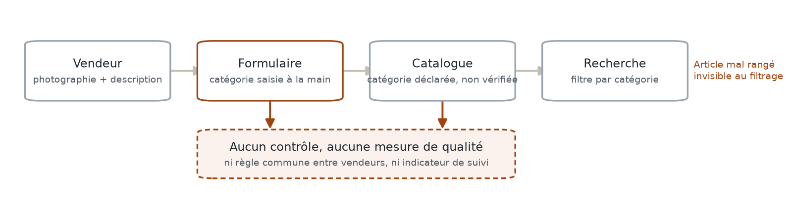
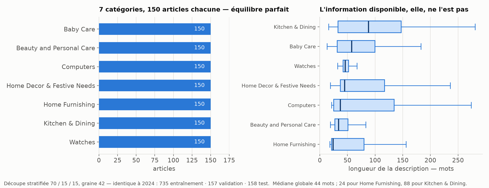
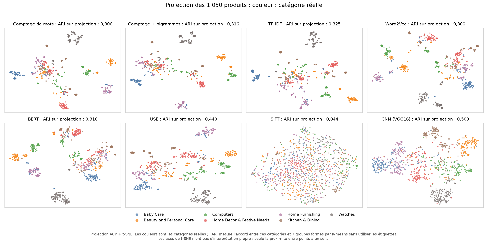
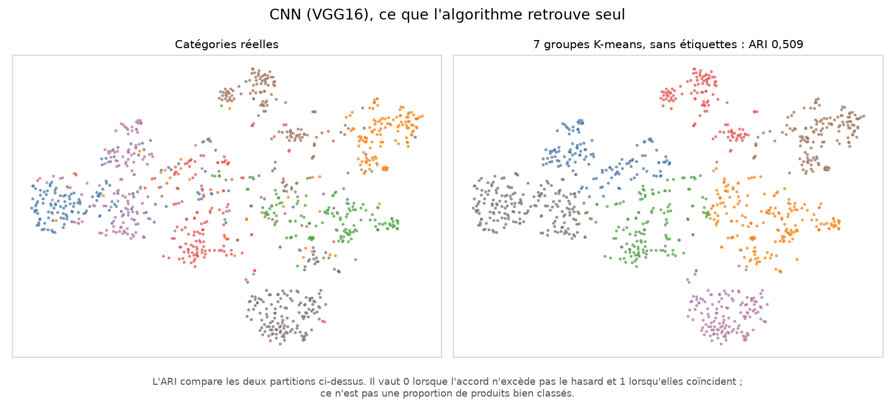
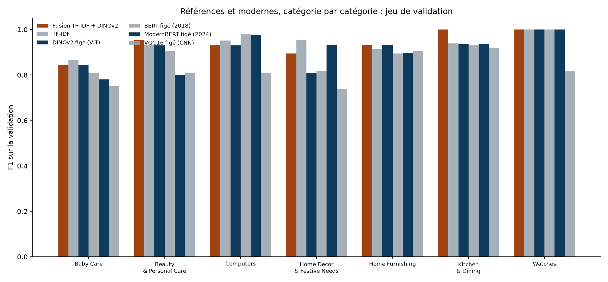
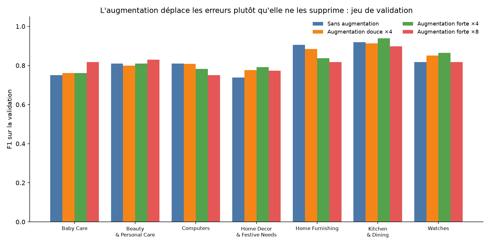
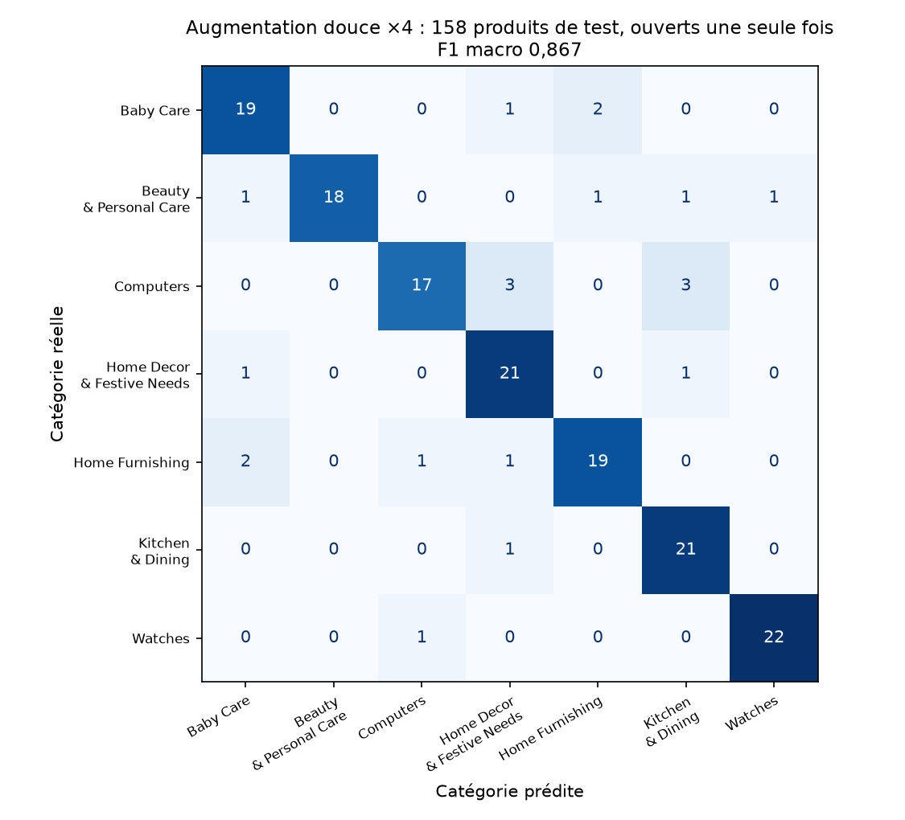
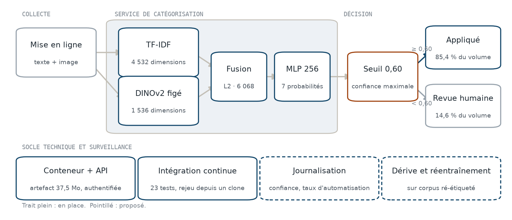

# Automatisation de la catégorisation d'articles sur une place de marché

**Rapport de conduite de projet AI Engineering**

Richard Hugou · août 2026

---

# 1. Contexte et analyse des besoins

## 1.1 Contexte de l'organisation

| Élément | État constaté |
|---|---|
| Activité | place de marché généraliste anglophone, mise en relation vendeurs et acheteurs |
| Modèle de mise en ligne | dépôt libre par le vendeur : une photographie, une description, une catégorie déclarée |
| Volume | catalogue en phase de croissance ; échantillon de travail de 1 050 articles sur 7 catégories |
| Maturité IA et MLOps | nulle. Aucun modèle en service, aucune chaîne de données outillée, aucun indicateur de qualité du catalogue |
| Moyens de calcul | poste de travail local, sans accélérateur dédié ni budget d'infrastructure ouvert |

Enjeux exprimés par le commanditaire : fluidifier la mise en ligne côté vendeur, fiabiliser le
filtrage par catégorie côté acheteur. Le second dépend du premier : un article mal rangé n'est pas
retrouvé par l'acheteur qui filtre, et le vendeur n'en est jamais informé.

Le moment est déterminé par la trajectoire du catalogue, non par un incident : l'automatisation doit
être disponible avant que le volume rende la correction manuelle impraticable.

**Contraintes de départ.**

- Techniques : calcul local, absence d'accélérateur, artefacts devant rester transportables.
- Sécurité : aucune donnée personnelle dans le périmètre ; descriptions et photographies fournies
  par les vendeurs, donc entrées non maîtrisées.
- Scalabilité : la solution doit tenir sur un catalogue d'un ordre de grandeur supérieur à
  l'échantillon.
- Déploiement : aucune plateforme d'hébergement de modèle en place à la date du projet.

## 1.2 Recueil et analyse du besoin métier

**Parties prenantes.**

| Partie prenante | Rôle dans le projet | Attente principale |
|---|---|---|
| Lead Data Scientist | commanditaire, cadrage et arbitrage technique | faisabilité établie avant tout engagement |
| Équipe catalogue | propriétaire de la nomenclature, arbitre des frontières ambiguës | règles de classement explicites et stables |
| Vendeurs | producteurs de la donnée d'entrée et de l'étiquette actuelle | mise en ligne plus rapide, sans saisie contrainte |
| Acheteurs | consommateurs du filtrage | catégories fiables |
| Équipe plateforme | intégration et exploitation | interface simple, coût d'exploitation prévisible |

**Méthode de recueil.** Le besoin a été recueilli par deux voies, sans atelier collectif :

1. **Brief écrit du commanditaire**, en deux demandes successives : établir la faisabilité à partir
   des données existantes, puis produire une classification supervisée à partir des images. Une
   troisième demande, distincte, porte sur la collecte de nouveaux produits via une interface
   externe.
2. **Analyse documentaire du jeu de données**, outillée : profilage des champs, des longueurs de
   description, des formats d'image, du taux de complétude (`scripts/profile_data.py`). Cette
   analyse a fait remonter deux besoins non exprimés dans le brief, la neutralisation du champ
   `brand` et l'harmonisation des formats d'image.

La reformulation du besoin a été soumise au commanditaire avant tout développement, sous la forme du
périmètre repris en 1.2 ci-dessous.

**Objectifs.**

| Nature | Objectif | Traduction mesurable |
|---|---|---|
| Business | réduire le temps de mise en ligne | part du catalogue classée sans intervention humaine |
| Business | réduire les articles mal rangés | taux de propositions correctes sur la part automatisée |
| Technique | établir que la catégorie est déductible des données existantes | accord entre groupes non supervisés et catégories réelles |
| Technique | disposer d'un modèle évalué sur données jamais vues | F1 macro et exactitude sur un jeu réservé |
| Technique | garantir la reproductibilité de la chaîne | rejeu complet en une commande, depuis un dépôt vierge |

**Contraintes fonctionnelles, non fonctionnelles et réglementaires.**

| Type | Contrainte | Conséquence retenue |
|---|---|---|
| Fonctionnelle | premier niveau de nomenclature uniquement, 7 catégories | granularité fine hors périmètre |
| Fonctionnelle | proposition, jamais imposition, de la catégorie au vendeur | sortie probabiliste, décision séparée du modèle |
| Non fonctionnelle | latence compatible avec une mise en ligne interactive | mesure du coût d'inférence par article |
| Non fonctionnelle | reproductibilité et traçabilité des essais | découpe unique, graine fixe, versions épinglées |
| Organisationnelle | aucune équipe d'annotation disponible | pas de ré-étiquetage massif du corpus |
| Réglementaire | corpus sans donnée personnelle, images sous licence de recherche | usage d'étude ; toute extension à des données vendeurs relève du RGPD |
| Éthique | l'étiquette de référence est produite par les vendeurs | la performance mesurée est bornée par la qualité de cette référence |

**Hiérarchisation des besoins.** Chaque besoin est coté sur son impact métier et sur l'effort de
réalisation, puis positionné. La cotation est celle du commanditaire pour l'impact, celle du projet
pour l'effort.

| Besoin | Impact | Effort | Décision |
|---|---|---|---|
| Établir la faisabilité avant tout engagement | fort | faible | **retenu, priorité 1** |
| Classer automatiquement à partir du texte et de l'image | fort | moyen | **retenu, priorité 2** |
| Décider quand ne pas trancher, et router en revue humaine | fort | faible | **retenu, priorité 3** |
| Neutraliser les champs porteurs de fuite (`brand`) | moyen | faible | **retenu, priorité 4** |
| Éprouver la collecte externe pour un élargissement de gamme | moyen | moyen | **retenu, priorité 5** |
| Classification hiérarchique complète | moyen | fort | écarté de ce périmètre |
| Réglage fin des extracteurs pré-entraînés | faible | fort | écarté, volume insuffisant |
| Interface de correction pour l'équipe catalogue | faible | moyen | reporté après mise en service |

Les cinq premiers besoins constituent le périmètre du projet. Les trois derniers sont documentés
comme perspectives en partie 6.

---

# 2. Audit de la solution existante

## 2.1 Processus en place

Aucune brique logicielle n'intervient aujourd'hui entre le vendeur et le catalogue. La catégorie est
saisie dans un formulaire libre, enregistrée telle quelle, puis utilisée comme clé de filtrage.



| Composant | Nature | Outillage |
|---|---|---|
| Saisie | formulaire de mise en ligne | champ de nomenclature déclaratif |
| Stockage | catalogue produits | arborescence de catégories sur plusieurs niveaux |
| Restitution | recherche et filtres | filtrage exact sur le premier niveau |
| Contrôle qualité | aucun | ni règle partagée, ni revue, ni indicateur |

Données disponibles par article : `product_name`, `description` rédigée par le vendeur,
`product_category_tree`, une photographie, et une quinzaine de champs annexes hors périmètre.

**Exemple de référence, conservé dans tout le rapport.**

| Champ | Contenu |
|---|---|
| `product_name` | V9 METAL STRAP Analog Watch – For Men |
| `description` | *Specifications of V9 METAL STRAP Analog Watch – For Men. General Type Analog. Style Code METAL STRAP. Occasion Casual. Ideal For Men. Warranty NO. Body Features Dial Shape Round. Strap Color STEEL. Dial Color BLACK.* |
| `product_category_tree` | `["Watches >> Wrist Watches >> V9 Wrist Watches >> ..."]` |
| `image` | photographie de 1 152 × 1 816 pixels |

## 2.2 Démarche d'audit et adéquation aux besoins

**Démarche.** Trois étapes, outillées et rejouables : profilage descriptif de chaque champ, contrôle
de la cible, contrôle des entrées. Référentiel appliqué : complétude, validité, cohérence,
représentativité, absence de fuite. L'audit porte sur les données et sur le processus, aucun
composant logiciel n'étant en place.

**Cible.** La catégorie n'est pas un champ, mais le premier niveau d'une chaîne d'arborescence mal
formée, aux échappements incohérents. Son extraction produit les sept catégories du périmètre :
*Baby Care*, *Beauty and Personal Care*, *Computers*, *Home Decor & Festive Needs*,
*Home Furnishing*, *Kitchen & Dining*, *Watches*. Elle est déclarée par les vendeurs : la référence
d'évaluation est elle-même faillible.

**Entrées.**

- Descriptions : formulaires de spécifications aplatis, non des textes rédigés. 13 à 587 mots,
  médiane 44. Longueur médiane variable selon la catégorie, de 24 mots pour *Home Furnishing* à 88
  pour *Kitchen & Dining*.
- Photographies : 890 tailles distinctes sur 1 050 fichiers, ratios de 0,23 à 4,36, jusqu'à
  93 mégapixels. Harmonisation obligatoire avant tout traitement.



**Fuite détectée.** Le champ `brand` présente 32 % de valeurs manquantes, et cette absence est
fortement corrélée à la catégorie : 95 % des 338 absences se concentrent sur trois catégories.

| Catégorie | Marque absente |
|---|---|
| Watches | 140 / 150 |
| Beauty and Personal Care | 109 / 150 |
| Kitchen & Dining | 71 / 150 |
| Baby Care | 16 / 150 |
| Home Decor & Festive Needs | 2 / 150 |
| Computers | 0 / 150 |
| Home Furnishing | 0 / 150 |

Un modèle recevant ce champ apprendrait une habitude de saisie, non le produit. Exclusion décidée,
indicateur d'absence compris.

**Adéquation du processus actuel aux besoins.**

| Axe | Constat | Écart au besoin |
|---|---|---|
| Fonctionnalités | la catégorie est renseignée pour tout article | aucune garantie qu'elle soit juste |
| Performances | saisie instantanée | aucune mesure de justesse, donc aucun pilotage possible |
| Réglementaire | pas de donnée personnelle traitée | conforme, aucun écart |
| Sécurité | entrées libres non validées | texte et image non contrôlés en entrée de chaîne |
| Scalabilité | coût de saisie linéaire au volume | la correction manuelle devient impraticable à l'échelle |
| Coûts | aucun coût logiciel | coût caché : invendus liés aux articles introuvables |

Deux écarts commandent la suite : l'absence de toute mesure de qualité, et l'absence de règle
commune entre vendeurs. Aucun ne se corrige par un ajustement du formulaire.

---

# 3. Solution technique cible

## 3.1 Identification, évaluation et hiérarchisation des cas d'usage

**Méthode.** Les cas d'usage sont dérivés des besoins hiérarchisés en 1.2, puis cotés sur trois
critères : valeur métier attendue, faisabilité établie par la mesure, effort de mise en œuvre. Un cas
d'usage n'est retenu que si sa faisabilité est démontrée sur les données du projet, non supposée.

| Cas d'usage | Valeur | Faisabilité | Effort | Rang |
|---|---|---|---|---|
| **U1** Proposer la catégorie à la mise en ligne | forte | établie, partie 3.2 | moyen | **1** |
| **U2** S'abstenir sous un seuil de confiance et router en revue | forte | établie, partie 4.2 | faible | **2** |
| **U3** Signaler les articles dont l'étiquette contredit le modèle avec confiance | moyenne | établie, sous-produit de U1 | faible | **3** |
| **U4** Élargir la gamme par collecte externe | moyenne | établie mais dégradée, partie 3.5 | moyen | **4** |
| U5 Classer sur la nomenclature complète | moyenne | non établie, volume insuffisant | fort | écarté |
| U6 Rechercher des articles visuellement similaires | faible | plausible, non mesurée | moyen | écarté |

U1 à U3 forment le service cible et partagent un même modèle : U2 et U3 se dérivent des
probabilités produites par U1, sans coût supplémentaire. U4 est traité comme une étude distincte.

## 3.2 Comparatif des approches

**Première question : l'information est-elle présente dans les données existantes ?** Les catégories
sont masquées, huit représentations du texte et de l'image sont projetées, les sept imposées par le
brief et une variante en bigrammes, un partitionnement en sept groupes est calculé, puis l'accord avec
les catégories réelles est mesuré par l'indice de Rand ajusté. Cette étape est descriptive et porte sur tout le corpus ; aucune décision de modèle n'en
découle.

| Représentation | Modalité | Dimensions | Accord, projection | Accord, espace complet |
|---|---|---|---|---|
| **CNN (VGG16)** | image | 512 | **0,510** | **0,540** |
| USE | texte | 512 | 0,440 | 0,333 |
| TF-IDF | texte | 5 000 | 0,325 | 0,214 |
| Comptage + bigrammes | texte | 5 000 | 0,316 | 0,227 |
| BERT | texte | 768 | 0,316 | 0,288 |
| Comptage de mots | texte | 2 444 | 0,306 | 0,270 |
| Word2Vec | texte | 300 | 0,300 | 0,207 |
| SIFT + BoVW | image | 256 | 0,044 | 0,056 |

Règle de lecture : un indice de 0,51 n'est pas une proportion d'articles bien classés, mais une
mesure de correspondance entre deux partitions. La mesure est rapportée deux fois, avant et après
réduction, la réduction étant déformante.



Constats :

- Sur les mêmes photographies, un réseau convolutif atteint 0,510 quand SIFT reste au niveau du
  hasard. Une méthode reconnue peut répondre à une autre question que celle posée.
- VGG16 est la seule représentation meilleure avant réduction qu'après : la séparation existe dans
  l'espace d'origine.
- Côté texte, un comptage simple de mots fait jeu égal avec BERT. Sur des fiches de spécifications,
  le vocabulaire discrimine et la syntaxe est presque absente.



Correspondance de un à un entre groupes et catégories pour VGG16 (informatique 87 %, montres 86 %,
beauté 80 %). Deux zones de confusion : un groupe de textiles imprimés photographiés à plat mêle
*Home Furnishing* et *Baby Care*, 69 articles déplacés ; 31 objets décoratifs de *Home Decor* partent
vers l'ameublement. L'algorithme regroupe par matière et mise en scène, la nomenclature par usage
commercial.

**Conclusion de l'étape : l'information nécessaire est présente dans les données déjà fournies par
les vendeurs.** Le cas d'usage U1 est faisable. L'image en est la source la plus prometteuse en
non supervisé.

**Deuxième question : quelle représentation retenir en supervisé ?** Protocole commun à toutes les
lignes qui suivent : découpe stratifiée figée des 1 050 articles en 735 entraînement, 157 validation,
158 test ; extracteurs pré-entraînés conservés figés ; une architecture de classifieur unique, un
perceptron à une couche cachée de 256 neurones, entraîné indépendamment derrière chaque
représentation. Un écart entre deux lignes ne peut donc provenir que de la représentation. Sélection
au F1 macro sur la validation ; le jeu de test n'intervient jamais dans la sélection.

| Représentation | Modalité | Dimensions | F1 macro, validation |
|---|---|---|---|
| **TF-IDF** | texte | 4 532 | **0,9365** |
| DINOv2 figé, Vision Transformer | image | 1 536 | 0,9118 |
| BERT figé | texte | 768 | 0,9050 |
| ModernBERT figé | texte | 768 | 0,9035 |
| VGG16 figé, CNN | image | 512 | 0,8216 |

- Texte : ModernBERT et BERT sont séparés de 0,0015 dans ce régime figé, et la référence lexicale
  TF-IDF les devance tous deux.
- Image : DINOv2 dépasse VGG16 de neuf points, sur les mêmes photographies et dans les mêmes
  conditions.
- Le VGG16 de ce tableau reproduit exactement le résultat sans augmentation de la partie 3.3 : les
  deux volets se recoupent.



**Troisième question : les deux modalités se complètent-elles ?** Les deux meilleures représentations
par modalité sont concaténées après normalisation ligne à ligne, soit 6 068 caractéristiques, avec la
même architecture de classifieur.

| Configuration | F1 macro, validation |
|---|---|
| Fusion TF-IDF ⊕ DINOv2 | **0,9366** |
| TF-IDF seul | 0,9365 |

Quasi-égalité : aucun gain de la multimodalité n'est établi sur ce corpus. La règle de sélection
fixée d'avance, meilleur F1 macro de validation, désigne la fusion. La lecture par catégorie est plus
informative que la moyenne : la fusion gagne sur *Kitchen & Dining* et *Beauty and Personal Care*,
perd sur *Computers* et *Home Decor & Festive Needs*.

**Avantages et inconvénients des approches candidates.**

| Approche | Avantage | Inconvénient |
|---|---|---|
| TF-IDF seul | performance de tête, coût négligeable, artefact léger, interprétable terme à terme | dépend du vocabulaire ; muet sur un article mal décrit |
| Encodeur de texte figé | robuste aux reformulations | ne devance pas TF-IDF ici ; coût d'inférence supérieur |
| VGG16 figé | rapide, largement éprouvé | neuf points en dessous de DINOv2 |
| DINOv2 figé | meilleure représentation image, indépendante du texte | poste de calcul dominant |
| **Fusion TF-IDF ⊕ DINOv2** | **retenue par la règle de sélection ; les deux modalités ne faiblissent pas aux mêmes endroits** | **coût de DINOv2 sans gain moyen établi** |

## 3.3 Classification supervisée à partir des images seules

Demande distincte du commanditaire, traitée avec le même protocole. Extracteur VGG16 figé, tête de
classification apprise, quatre stratégies d'augmentation comparées sur la validation.

| Stratégie | Images d'entraînement | F1 macro, validation |
|---|---|---|
| Augmentation douce ×4 | 3 675 | **0,828** |
| Augmentation forte ×4 | 3 675 | 0,827 |
| Sans augmentation | 735 | 0,822 |
| Augmentation forte ×8 | 6 615 | 0,815 |

Écart maximal de 0,006 point : insuffisant, sur cet échantillon de validation, pour conclure à une
amélioration nette. La lecture par catégorie montre que l'augmentation déplace les erreurs plutôt
qu'elle ne les supprime. Configuration retenue selon la règle fixée d'avance, augmentation douce ×4,
avantage non établi.



Évaluation finale, jeu de test, une seule ouverture : **137 / 158 articles correctement classés,
exactitude 86,7 %, F1 macro 0,867**, sans aucun recours au texte.



La confusion *Baby Care* et *Home Furnishing* reproduit celle de l'étude non supervisée : ambiguïté
réelle entre certaines images, réduite par la supervision, non éliminée.

## 3.4 Architecture cible



**Évaluation finale de la solution retenue.** Jeu de test, une seule ouverture :
**F1 macro 0,987, 156 / 158 articles correctement classés**.

Les deux erreurs restantes : un lit king size étiqueté *Beauty and Personal Care*, lu
*Home Furnishing*, étiquette probablement incohérente ; un sticker mural lu *Baby Care*, ambiguïté
d'univers domestique déjà observée en partie 3.2.

**Justification des choix techniques.**

| Choix | Justification |
|---|---|
| Extracteurs figés, non réglés finement | 735 images d'entraînement ; le réglage fin relève d'une expérimentation dédiée et isolerait mal la qualité des représentations |
| Perceptron à une couche de 256 | architecture constante entre toutes les lignes comparées : c'est ce qui rend le comparatif interprétable |
| Fusion par concaténation, normalisation ligne à ligne | sans état à ajuster entre articles, donc sans fuite possible du jeu de test |
| Sérialisation en artefact unique de 37,5 Mo | transportable, chargeable sans dépôt ni base de modèles |
| Interface applicative conteneurisée | déploiement reproductible, indépendant de la machine hôte |
| Décision par seuil, séparée du modèle | le seuil est un paramètre métier révisable sans réentraînement |
| Journalisation et surveillance de dérive | proposées, non réalisées : elles n'ont pas d'objet avant une mise en service |

**Adéquation de la cible aux besoins, six axes.**

| Axe | Mesure ou disposition | Verdict |
|---|---|---|
| Fonctionnalités | U1, U2 et U3 couverts par un modèle unique | conforme au périmètre |
| Performances | F1 macro 0,987 et 156 / 158 sur jeu réservé | conforme |
| Réglementaire | aucune donnée personnelle ; champ `brand` écarté ; images sous licence de recherche | conforme en l'état, à réexaminer avant extension |
| Sécurité | artefact sans secret ; entrées libres à valider ; interface à authentifier | disposition à mettre en place |
| Scalabilité | 58,22 ms par article, soit 1,62 h de calcul pour 100 000 articles | conforme, traitement par lots possible |
| Coûts | extraction d'image à 99,8 % du coût d'inférence | conforme, avec un levier identifié |

Le coût est concentré sur un seul poste, ce qui en fait le levier d'optimisation évident : renoncer à
la modalité image ramènerait l'inférence à 0,12 ms par article pour 0,0001 point de F1 macro de
validation cédé.

| Poste | Coût mesuré par article |
|---|---|
| Extraction DINOv2 | 58,09 ms |
| Vectorisation TF-IDF | 0,10 ms |
| Tête de classification | 0,02 ms |
| **Total** | **58,22 ms** |

## 3.5 Collecte externe pour un élargissement de gamme

Cas d'usage U4, éprouvé sur l'épicerie fine. Source retenue : Open Food Facts, sans inscription,
donc rejouable par un tiers. Correspondances vers le schéma cible isolées dans un dictionnaire
unique. Filtrage par catégorie plutôt que par texte libre.

Résultat : 10 produits collectés, cinq champs renseignés, composition manquante pour 2 produits.

Constats sur le contenu :

- 5 étiquettes de catégorie différentes pour 10 produits, dont des libellés non traduits
  (*fr:Champagnes bruts*) et un quasi vide de sens (*fr:Liquide*) ;
- un libellé mêlant caractères cyrilliques et fragments d'étiquette, signe d'une saisie
  collaborative non contrôlée ;
- un cocktail à la pêche parmi les « champagnes ».

La faisabilité technique est établie, la qualité des métadonnées ne l'est pas. Les catégories y sont,
comme sur la place de marché, déclarées par des contributeurs sans règle commune : le même problème
qu'en partie 2, sur une source que le projet ne maîtrise pas.

---

# 4. Stratégie de mise en œuvre et d'industrialisation

## 4.1 Démarche projet

Découpage en lots courts, chacun sur sa propre branche, fusionné après revue, puis étiqueté. Les
jalons ci-dessous sont les versions réellement publiées du dépôt.

| Phase | Contenu | Outils | Jalon | État |
|---|---|---|---|---|
| 1. Audit des données | profilage, contrôle de la cible, détection de fuite | pandas, matplotlib | `v0.1.0` | réalisé |
| 2. Faisabilité | huit représentations, projection, partitionnement, accord | scikit-learn, PyTorch, TensorFlow Hub | `v0.1.0` | réalisé |
| 3. Comparatif supervisé | protocole constant, cinq représentations, fusion | scikit-learn, transformers | `v1.0.0` | réalisé |
| 4. Qualité et rejeu | tests unitaires, test anti-fuite, intégration continue | pytest, ruff, GitHub Actions | `v1.0.1` | réalisé |
| 5. Démonstrateur | interface de démonstration, trois modalités comparées | Streamlit, Docker | `v1.1.0`, `v1.1.1` | réalisé |
| 6. Documentation | rapport, carnets exécutés, README | Markdown, nbformat | `v2.0.0`, `v2.1.0` | réalisé |
| 7. Mise en service | interface applicative authentifiée, seuil de décision paramétrable | FastAPI, Docker | à planifier | proposé |
| 8. Surveillance | journalisation des prédictions, suivi du taux d'automatisation, détection de dérive | journaux applicatifs, tableau de bord | à planifier | proposé |
| 9. Réentraînement | corpus ré-étiqueté par l'équipe catalogue, rejeu du protocole | chaîne existante, inchangée | à planifier | proposé |

**Responsabilités.** Sur les phases 1 à 6, conception, réalisation et rédaction assurées par
l'auteur ; arbitrage du périmètre et validation des livrables par le commanditaire. Sur les phases 7
à 9, l'intégration relève de l'équipe plateforme, la revue des cas incertains et l'arbitrage des
frontières de nomenclature relèvent de l'équipe catalogue.

## 4.2 Aide à la prise de décision

**Indicateurs de succès, définis puis évalués.** Le seuil de décision est choisi sur la validation,
selon une exigence posée d'avance : au moins 99 % de propositions correctes sur la part automatisée.
Le seuil le plus bas qui la satisfait est 0,60. Le couple d'indicateurs est ensuite mesuré une seule
fois sur le jeu de test.

| Indicateur | Nature | Cible | Mesuré sur validation | Mesuré sur test |
|---|---|---|---|---|
| Taux d'automatisation | business | maximiser | 84,1 % | **85,4 %** |
| Propositions correctes sur la part automatisée | business | ≥ 99 % | 0,9924 | **0,9926** |
| Volume en revue humaine | business | minimiser | 25 articles sur 157 | **23 articles sur 158** |
| F1 macro | technique | ≥ 0,90 | 0,9366 | **0,9873** |
| Latence d'inférence | technique | compatible interactif | non applicable | **58,22 ms par article** |
| Rejeu complet de la chaîne | technique | une commande | vérifié en intégration continue | vérifié |

Une seule erreur subsiste dans la part automatisée du jeu de test, sur 135 articles traités sans
intervention. Le seuil transforme donc un modèle à deux erreurs en un service dont l'erreur résiduelle
automatisée est unitaire, au prix de 14,6 % du volume envoyé en revue.

**Risques et opportunités.**

| Risque | Portée | Levier d'atténuation |
|---|---|---|
| Étalon déclaratif bruité | plafonne toute performance mesurable | faire arbitrer un échantillon par l'équipe catalogue, en priorité les cas où le modèle contredit le vendeur avec confiance (U3) |
| Corpus artificiellement équilibré, 7 × 150 | performance non transposable telle quelle | réévaluer sur un extrait réel du catalogue avant mise en service |
| Photographies de catalogue soignées | dégradation probable sur des prises de vue vendeurs | mesurer sur un lot de photographies non retouchées |
| Dépendance à un extracteur pré-entraîné externe | rupture de disponibilité ou de licence | artefact figé et versionné localement ; TF-IDF seul comme repli à 0,0001 point près |
| Dérive du catalogue, nouvelles familles de produits | perte de justesse silencieuse | surveillance du taux d'automatisation, seuil d'alerte, réentraînement planifié |
| Concentration du coût sur l'extraction d'image | coût d'exploitation | traitement par lots, cache des caractéristiques, ou bascule sur le texte seul |

| Opportunité | Effet attendu |
|---|---|
| Le seuil est un paramètre métier | arbitrage automatisation contre justesse révisable sans réentraînement |
| Les probabilités servent trois cas d'usage | U2 et U3 sans développement supplémentaire |
| La modalité image est séparable | deux niveaux de service, économique ou complet |
| Chaîne rejouable en une commande | réentraînement à coût marginal une fois le corpus ré-étiqueté |

**Scénarios budgétaires.** Estimation, adossée aux mesures de la partie 3.4 et exprimée en
journées-homme ; aucun devis n'a été demandé à un fournisseur.

| Scénario | Périmètre | Charge estimée | Infrastructure | Inférence, 100 000 articles |
|---|---|---|---|---|
| A. Démonstrateur, état actuel | interface de démonstration, modèle sérialisé | réalisé | hébergement mutualisé, coût nul | 1,62 h de calcul |
| B. Mise en service progressive | interface authentifiée, seuil paramétrable, journalisation | 10 à 15 j | une instance de calcul standard | 1,62 h de calcul, par lots nocturnes |
| C. Industrialisation complète | B, plus surveillance de dérive, réentraînement outillé, interface de revue | 30 à 40 j | instance de calcul, stockage des journaux, tableau de bord | idem, avec réentraînement périodique |

Le scénario B suffit à ouvrir la valeur des cas d'usage U1 à U3. Le scénario C ne se justifie qu'une
fois le volume et la dérive observés.

**Impacts et leviers.**

| Impact | Analyse | Levier |
|---|---|---|
| Légal et réglementaire | corpus sans donnée personnelle ; images sous licence de recherche, non réutilisables en production | constituer un corpus propre à l'entreprise avant mise en service |
| Biais | la référence reproduit les habitudes de saisie des vendeurs ; l'équilibre 7 × 150 est artificiel | ré-étiquetage d'un échantillon arbitré ; réévaluation sur distribution réelle |
| Biais de nomenclature | les frontières *Home Decor*, *Home Furnishing*, *Baby Care* sont culturelles avant d'être visuelles | arbitrage explicite et documenté par l'équipe catalogue |
| Sécurité | descriptions et images sont des entrées non maîtrisées | validation des formats et des tailles en entrée, interface authentifiée, journalisation des accès |
| Latence | 58,22 ms par article, dominés par l'extraction d'image | traitement par lots ; repli texte seul si un appel interactif est exigé |
| Organisationnel | 14,6 % du volume en revue humaine, charge nouvelle et non affectée | dimensionner la file de revue avant mise en service, outiller la correction |
| Confiance des vendeurs | une proposition automatique contredisant la saisie peut être mal reçue | proposition et non imposition, motif affiché, possibilité de refus tracée |

---

# 5. Contrôle et suivi du projet

## 5.1 Tableau de bord de pilotage

| Indicateur | Source | Valeur de fin de projet |
|---|---|---|
| Avancement | jalons publiés du dépôt | 6 phases sur 6 du périmètre réalisées, 7 versions étiquetées |
| Délais | historique du dépôt | 4 lots de travail livrés, chacun sur sa branche puis fusionné |
| Livrables | dépôt et documentation | 3 scripts d'exécution, 6 carnets exécutés, rapport, démonstrateur en ligne |
| Qualité des données | profilage et contrôles | 1 fuite détectée et neutralisée, 2 anomalies de format corrigées |
| Qualité logicielle | intégration continue | 23 tests, dont un test anti-fuite ; lint et format vérifiés à chaque poussée |
| Performances | jeu réservé, une ouverture | F1 macro 0,987, 156 / 158 |
| Coût de calcul | mesure locale | chaîne complète rejouée en environ 20 minutes, sans coût d'infrastructure |

**Méthodologie de gestion.** Flux de travail à trois niveaux : `main` porte les versions publiées,
`develop` intègre, chaque lot vit sur sa propre branche avant fusion. Versions sémantiques,
étiquetées à chaque livraison. Intégration continue déclenchée sur les trois niveaux. Un correctif
urgent a suivi le chemin dédié (`hotfix/`), après détection d'un défaut de collecte des tests depuis
un clone vierge.

## 5.2 Outils et processus de suivi

**Méthodologie de test.**

| Niveau | Objet | Dispositif |
|---|---|---|
| Unitaire | découpe, métriques, fusion, vectorisation, optimisation | 23 tests, exécutés à chaque poussée |
| Intégrité du protocole | les trois parts sont disjointes | test dédié, échoue si une fuite apparaît |
| Reproductibilité | la chaîne se rejoue depuis un clone vierge | tâche d'intégration continue distincte |
| Non-régression numérique | le modèle rechargé depuis le disque reproduit le résultat publié | vérification à la sérialisation, artefact supprimé en cas d'écart |
| Bout en bout | interface de démonstration sur articles jamais vus | démonstrateur conteneurisé, en ligne |

**Contrôles ayant effectivement corrigé le projet.** Deux erreurs de méthode ont été détectées et
corrigées en cours de route, aucune n'ayant été signalée par un test en échec : le code fonctionnait,
il mesurait autre chose que ce qui était visé.

| Erreur | Détection | Correction | Conséquence |
|---|---|---|---|
| Comparaison des stratégies d'augmentation lue sur le jeu de test | revue du protocole | sélection reportée sur la validation | configuration retenue modifiée : le test désignait l'absence d'augmentation, la validation désigne l'augmentation douce |
| Standardisation par dimension avant projection | accord TF-IDF tombé à 0,001, au niveau du hasard | normalisation ligne à ligne | accord TF-IDF rétabli à 0,325 |

Chaque chiffre du rapport est pour cette raison accompagné de son protocole, et certains sont
rapportés deux fois.

**Suivi en production, proposé.**

| Objet | Indicateur | Déclencheur |
|---|---|---|
| Justesse perçue | taux de refus des propositions par les vendeurs | dépassement du niveau de référence |
| Automatisation | part du volume au-dessus du seuil | baisse durable du taux |
| Dérive des entrées | distribution des confiances maximales | déplacement de la distribution |
| Charge de revue | volume en file, délai d'écoulement | file non résorbée |
| Disponibilité | latence et taux d'erreur de l'interface | seuils d'exploitation |

---

# 6. Conclusion et recommandations

**Choix clés.** L'information nécessaire à la catégorisation est présente dans les données déjà
fournies par les vendeurs : la faisabilité est établie avant tout engagement. Le comparatif à
protocole constant désigne la fusion TF-IDF ⊕ DINOv2, qui obtient 0,987 de F1 macro et 156 articles
sur 158 sur un jeu réservé ouvert une seule fois. La décision est séparée du modèle par un seuil de
confiance choisi sur la validation, qui automatise 85,4 % du volume avec 0,9926 de propositions
correctes. Les modèles récents n'apportent pas systématiquement un gain : net en vision, nul ici sur
le texte figé, où une référence lexicale reste en tête.

**Recommandations, par ordre de priorité.**

1. Faire arbitrer par l'équipe catalogue les frontières ambiguës, et ré-étiqueter en priorité les
   articles où le modèle contredit le vendeur avec une confiance élevée.
2. Mettre en service le scénario B : interface authentifiée, seuil paramétrable, journalisation des
   prédictions et des confiances.
3. Dimensionner et outiller la file de revue humaine avant l'ouverture du service, 14,6 % du volume
   étant concerné.
4. Réévaluer la performance sur un extrait réel du catalogue, à distribution non équilibrée et
   photographies non retouchées, avant tout engagement de niveau de service.
5. Constituer un corpus propre à l'entreprise, les images d'étude étant sous licence de recherche.
6. Traiter la qualité des métadonnées externes avant d'envisager l'élargissement de gamme.

**Perspectives.** Réglage fin des extracteurs sur corpus élargi ; classification sur la nomenclature
complète ; augmentation d'images différenciée par type de produit plutôt qu'uniforme ; recherche
d'articles visuellement similaires, qui réutiliserait les représentations déjà calculées.

**Prochaines étapes.** Arbitrage du scénario budgétaire par le commanditaire, puis planification des
phases 7 à 9 avec l'équipe plateforme. La chaîne est rejouable en une commande : le réentraînement
sur corpus ré-étiqueté n'a pas de coût de développement.

---

# Annexes

## A. Rejeu de l'étude

```bash
python -m venv .venv && source .venv/bin/activate
pip install -r requirements-encoders.txt

python faisabilite.py                   # les huit représentations, projections, partitionnement, accord
python supervise_image.py               # classification supervisée et augmentation
python collecte_api.py                  # collecte « champagne » et fichier CSV
python scripts/comparer_modernes.py     # le comparatif des représentations et la fusion
python scripts/seuil_confiance.py       # seuil de décision et indicateurs d'automatisation
python scripts/cout_inference.py        # coût d'inférence, poste par poste
python scripts/schemas.py               # les deux schémas de flux et d'architecture
```

Le socle seul (`requirements.txt`) suffit pour l'exploration des données et les modèles classiques ;
`requirements-encoders.txt` ajoute les réseaux pré-entraînés, soit environ 3 Go de poids au premier
lancement. Les versions sont épinglées, la graine aléatoire est fixe, et la découpe des données est
définie dans un module unique (`src/pipeline.py`) appelé par tous les scripts. Les caractéristiques
extraites sont mises en cache sur disque : une seconde exécution ne recalcule ni SIFT ni les réseaux.

## B. Figures et fichiers produits

| Fichier | Contenu |
|---|---|
| `reports/fig3_transformations.png` | La chaîne de transformation du texte, sur un article réel |
| `reports/fig4_donnees.png` | Équilibre des classes et distribution des longueurs |
| `reports/fig5_projections.png` | Les huit projections en deux dimensions |
| `reports/fig6_clusters.png` | VGG16 : catégories réelles et groupes trouvés |
| `reports/fig7_ari.png` | L'accord entre groupes et catégories, par représentation |
| `reports/fig8_confusion_image.png` | Matrice de confusion du modèle supervisé image |
| `reports/fig9_augmentation_par_classe.png` | L'effet de l'augmentation, catégorie par catégorie |
| `reports/fig10_comparaison_par_classe.png` | F1 par catégorie des six configurations comparées |
| `reports/fig11_flux_actuel.png` | Le processus de catégorisation en place |
| `reports/fig12_architecture_cible.png` | L'architecture cible et son socle technique |
| `reports/faisabilite.csv` | Dimensions et accords des huit représentations |
| `reports/supervise_image_validation.csv` | Comparaison des stratégies d'augmentation |
| `reports/supervise_image_test.csv` | Résultat final du modèle image retenu |
| `reports/comparaison_validation.csv` | Le comparatif des représentations, sur la validation |
| `reports/comparaison_test.csv` | L'évaluation finale de la fusion, sur le jeu réservé |
| `reports/seuil_confiance.csv` | Automatisation et justesse par seuil, validation et test |
| `reports/cout_inference.json` | Coût d'inférence par poste et par volume |
| `reports/produits_champagne.csv` | Les dix produits collectés via l'interface externe |

## C. Ressources du projet

| Ressource | Adresse |
|---|---|
| Dépôt du projet | https://github.com/richardhugou/product-category-classifier |
| Démonstrateur en ligne | https://huggingface.co/spaces/trikwi/projet55 |
| Portfolio | https://portfolio.richardh.fr |
| Description du dépôt | `README.md` |
| Carnets exécutés, dans l'ordre de la mission | `notebooks/` |

## D. Notes techniques

**Universal Sentence Encoder et la cohabitation TensorFlow et PyTorch.** USE est distribué pour
TensorFlow, quand le reste de la chaîne repose sur PyTorch. Chargées dans un même processus, les deux
bibliothèques se sont bloquées mutuellement sans lever d'erreur ; isolé dans son propre processus, le
modèle se charge en deux secondes. L'encodage USE est donc délégué à un sous-processus dédié, ce qui
permet d'employer le modèle de référence lui-même. Par ailleurs, `tensorflow_hub` importe encore
`pkg_resources`, retiré de `setuptools` à partir de la version 81 : la borne haute des dépendances
est là pour cette seule raison.

**Point d'entrée de l'interface Open Food Facts.** L'ancien point d'entrée `cgi/search.pl`, déprécié,
a renvoyé une erreur de service lors du premier essai. Le script utilise le point d'entrée v2,
maintenu, et réessaie avec une attente croissante.

**Normalisation avant projection.** Chaque article est ramené à une longueur unitaire avant l'ACP, ce
qui rend la distance euclidienne équivalente à la distance cosinus. La standardisation par dimension,
testée d'abord, amplifiait les termes rares au point de ramener l'accord TF-IDF au niveau du hasard.

**Mesure du coût d'inférence.** Latences mesurées sur poste local, accélérateur intégré, sur un
échantillon de 16 photographies pour l'extraction et sur les 158 articles du jeu réservé pour le texte
et la tête de classification. Un passage à blanc précède la mesure pour ne pas compter l'allocation
initiale.
